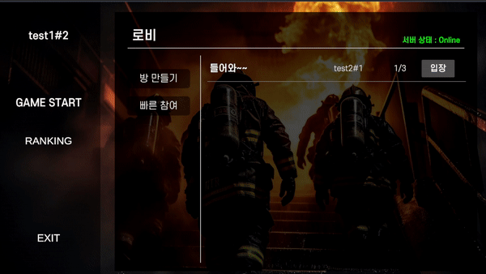
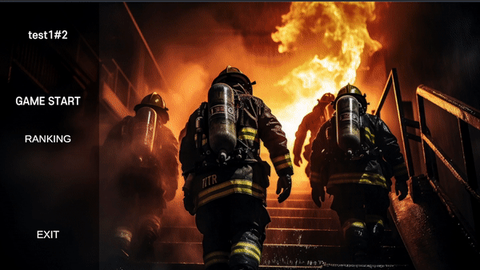
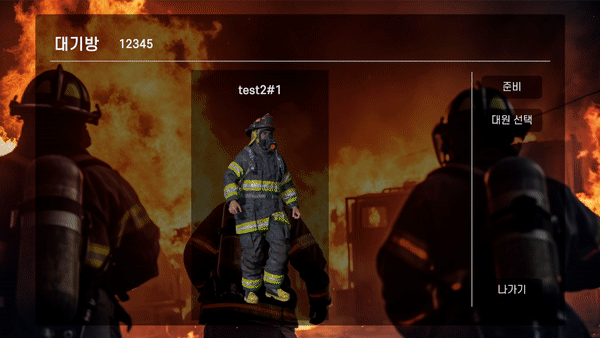
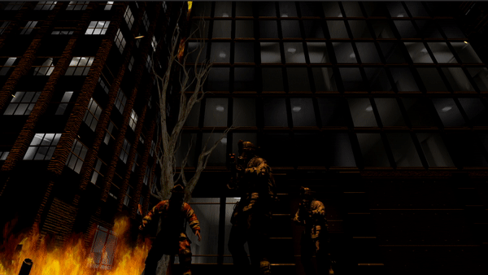

# 화마(火魔)

## 1️⃣ 프로젝트 개요

### 개발 기간
개발기간 2023.08.21 ~ 2023.10.06 (6주)

### Only-One 메타버스 팀

### 역할 분담

- 김영민 : 팀장, 기획, 발표담당, 사운드 및 이펙트 담당, 배포 홈페이지 구현
- 강동혁 : 스테이지 구성, 아이템 로직 구현
- 김재원 : Photon Server 및 멀티플레이 구현
- 우승빈 : Infra, Spring Server로 랭킹 시스템 및 회원관리, 게임 UI 구현
- 김민식 : 스테이지 구성, 애니메이션 담당
- 차영범 : 캐릭터, 몬스터, 보스 로직 구현

### 기획 배경

- 소방관을 주제로 만든 컨텐츠가 전반적으로 부족. 영화 드라마 등의 소재로는 사용하고 있지만 게임 컨텐츠로는 소방관이 주로 나오는 게임이 잘 없음.
- 소방관을 주제로 한 게임을 만들어, 그들의 업적과 마음가짐을 존중하며 게임을 즐기며 동시에 그들에 대한 응원과 감사의 마음이 함께 전해지고 소방관들의 열정과 노력, 그리고 그들이 지니고 있는 귀중한 가치를 더욱 잘 알리는 계기가 되도록 함.

### 목표

- 3인 1팀이 되어 협력 및 팀워크, 전략적 사고 개발과 소통 기회를 제공한다.
- 게임을 통해 소방관의 사명을 생각하고 응원하는 마음을 담을 수 있도록 하는 것

## 2️⃣ 게임 소개

### 게임 설명

- 3D TPS + 로그라이크 게임
- 플레이어가 소방관이 되어서 마을에 불을 지르는 몬스터를 퇴치하는 게임.
- 각 스테이지 별로 몬스터가 나오고, 퇴치하며 길을 따라 진행함. 마지막 스테이지에서 보스를 잡으면 게임 클리어.
- 게임 시작부터 클리어까지 타이머가 존재하고, 클리어 후 화면에서 랭킹 화면으로 경쟁을 유도할 수 있다.

### 게임 화면

> **회원가입**   

> **로그인**   

> **로비 방목록**   

> **로비 랭킹목록**   

> **방 정보**   

> **로딩 화면**   

> **스테이지 화면**   

> **보스 스테이지 화면**   

> **보스 섬멸 화면**   

> **결과 화면**   

## 3️⃣ **개발 환경**

### ⚙ Management Tool
- 형상 관리 : Gitlab, 외장SSD(에셋용)
- 이슈 관리 : Jira
- 커뮤니케이션 : Mattermost, Notion, Discord
- 디자인 : Unity

### 💻 IDE
- Visual Studio 2022
- Intellij CE 2023.1.3

### 📱 Client
- Unity `2022.3.7f1`
- Photon Engine `2.43`

### 📁 Server
- Springboot `2.7.13`
- Lombok
- Spring Data JPA 
- Spring Web

### 💾 Database
- MySQL

### 🌁 Infra
- Jenkins 2.401.3
- docker-compose
- SSL
- Nginx

### 🎞 Storage
- Amazon EC2(Ubuntu 20.04)

## 4️⃣**주요 기술**

### PhotonNetwork

- 간단한 멀티플레이 기능을 구현할 수 있는 패키지. 해당 패키지를 프로젝트 내에 불러오면 photon에서 제공하는 여러 함수들을 사용하여 방 만들기, 동기화 등 다양한 기능들을 편리하게 사용할 수 있다.

### Cinemachine

- 유니티에서 제공하는 카메라 기능. 다양한 카메라 모션을 지원하며, 장애물을 자연스럽게 피하거나 영화를 보는 듯한 카메라 움직임을 구현할 수 있다.

### UnityWebHttp

- 유니티에서 서버와 통신할 수 있도록 json 형식으로 데이터를 주고받는 형식

### PostProcessing

- 각 Scene의 쉐이더를 담당하는 기능. 여러가지 수치를 조절하여 Scene내의 조명, 효과, 분위기를 조성할 수 있음.

## 5️⃣**설계 문서**

### 🎨 [와이어프레임](https://www.notion.so/404c63ffcecd4ed080c3e8c89b1791fd?pvs=4)

### [📃 요구사항 정의서](./Exec/프로젝트 명세서/프로젝트명세서.md)

### [📝 인터페이스 명세서](./Exec/API 명세서/api.md)

### [📏 ERD](./Exec/데이터베이스 설계/database.md)

### [📐 시스템 아키텍처](./Exec/아키텍처/architecture.md)

### [💰 버그 리포트](https://www.notion.so/631b122190ea49c28b324331e098b720?pvs=4)